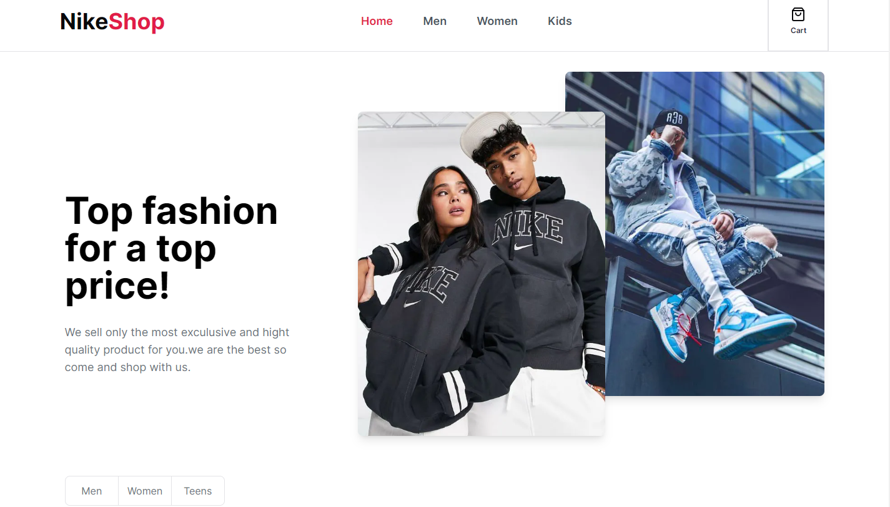

# Nike Shop - Nike Online Store

#### About The Project

Nikeshop is a full-stack website built with NextJS 14 and TypeScript, with the ability to connect to Stripe's payment gateway.

In this project, Tailwind and Shadcn frameworks are used for styling and USE-SHOPPING-CART is also used for shopping cart management in Strip.
And finally, Sanity cms has been used to manage APIs in this project.

---

#### Built With
In this section, we have listed the tools, frameworks and plugins used in the Pripto project

- Nextjs
- Typescript
- Tailwind
- Shadcn
- USE-SHOPPING-CART
- Stripe

---
